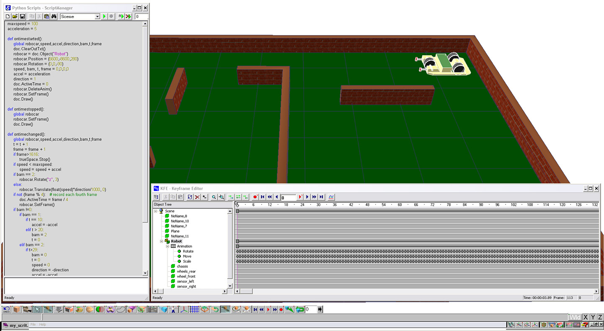
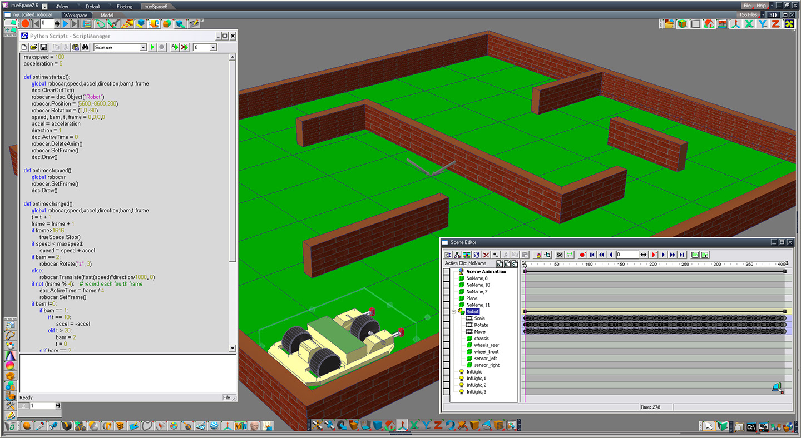

# RoboCar
Simplest robotic car

## Requirements

* [Caligari TruSpace][2] (TS) from version 4.2 to the last available v7.61
* Python (already built in TS)
 
## Files

* robocar.SCN – scene file for TS
* [Scene.py](Scene.py) – listing of scene script, written for buil in Python v1.5. You don't need to load this script to scene because it already included them. 
* img – folder with images and screenshots for this README project illustration.
* LICENSE – GNU General Public License v3.0

## How it works

Load load scene file "robocar.SCN" to the TrueSpace 3D environment. You can use [TrueSpace][2] from Caligari over a wide range of versions: from 4.2 to the last available 7.51.

For example, in TS of version 4.2 it look like this: 

And for 7.61 this looks like: 

After load scene file to the TS just play script. It will automatically drive the car and record animation. For optimization purpose, only each fourth frame will be recorded. If the maximum 1616 frame number exceeded – script automatically stop play the entire scene. Please notice: an 1616 frame number means an 404 animation frame number (1616 / 4 == 404).  

After record animation you can create an AVI video from that animation and load it to the YouTube, how did I: [Video][1]

## Author 

An0ther0ne 

[1]: https://youtu.be/sIAKDv0vQ1E "YouTube Video"
[2]: http://truespace3d.free.fr/index.php/truespace-7-6/ "Caligari TrueSpace 7.61" 

