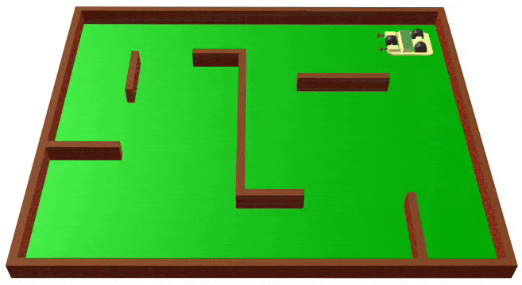

# RoboCar
Simplest robotic car

## Requirements

* [Caligari TruSpace][2] (TS) from version 4.2 to the last available v7.61
* Python (already built in TS)
 
## Files

* robocar.SCN – scene file for TS
* [Scene.py](Scene.py) – listing of scene script, written for buil in Python v1.5. You don't need to load this script to scene because it already included them. But you can create you own scene, insert to them robot car object (see the next below) and assign this script to scene.
* robocar.cob - Single Robot car 3D-object.
* img – folder with images and screenshots for this README project illustrations.
* LICENSE – GNU General Public License v3.0

## How it works

Load load scene file "robocar.SCN" to the TrueSpace 3D environment. You can use [TrueSpace][1] from Caligari over a wide range of versions: from 4.2 to the last available 7.51.

For example, in TS of version 4.2 it look like this: 

And for 7.61 this looks like: 

After load scene file to the TS just play script. It will automatically drive the car and record animation. For optimization purpose, only each fourth frame will be recorded. If the maximum 1616 frame number exceeded – script automatically stop play the entire scene. Please notice: an 1616 frame number means an 404 animation frame number (1616 / 4 == 404).  

After record animation you can create an AVI video from that animation and load it to the YouTube, how did I: 
* [Video 1][2]
* [Video 2][3]

## Algorithm explanation

1) Car speed up (with some acceleration value) and move forvard until it bumps into a wall or an other object. 

2) After collision it roll backward and turn left (version 1). In version 2 of scene script robocar may also turn right with 30% probability.

3) Go to step 1

## Advanced

You may build or load you own scene, load robocar.cob object to them and assign this [script](Scene.py) to that scene.

You can also create you own model for robotised car, but notice to rename it to "Robot", because script finds object to drive by name.

For example: 

* Load supplied with TS 'labyrinth.scn'
* Clean it from unnecessary objects and scripts
* Insert 'robocar.cob' to scene
* Changing location and rotation of inserted "Robot" object and memorise it
* Assign text of 'Scene.py' to the 'Scene' section in ScriptManager
* Edit some global constants at the begin of script with memorised values
* Rus script and have fun! 
 

## Author 

An0ther0ne
 

[1]: http://truespace3d.free.fr/index.php/truespace-7-6/ "Caligari TrueSpace 7.61"
[2]: https://youtu.be/sIAKDv0vQ1E "YouTube RoboCar Video 1" 
[3]: https://youtu.be/PDbpFHLaCJM "YouTube RoboCar Video 2"
